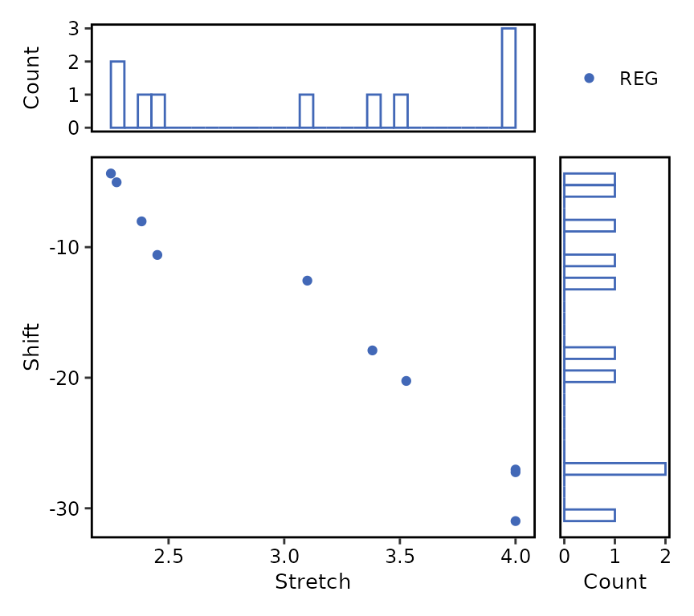
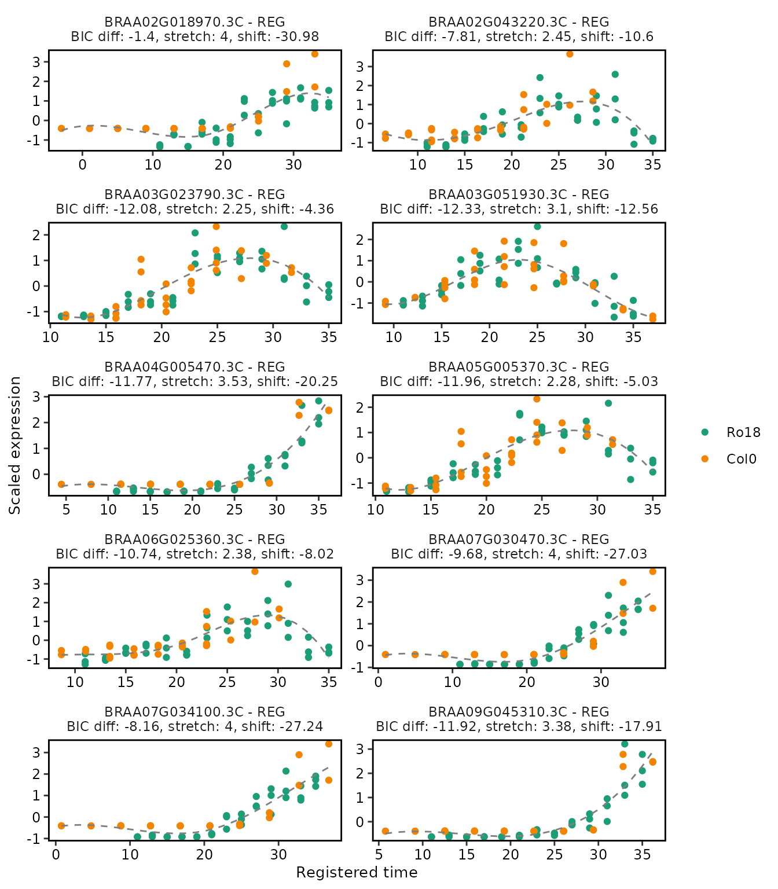
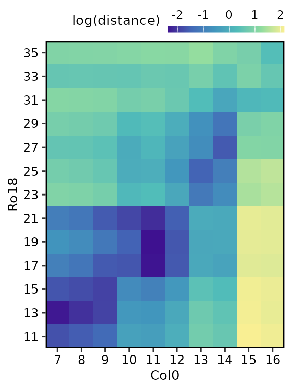
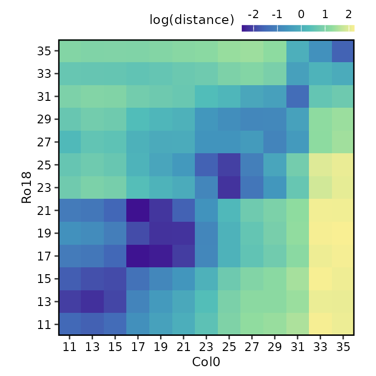

# Processing results

After running the registration function
[`register()`](https://ruthkr.github.io/greatR/reference/register.md) as
shown in the [registering
data](https://ruthkr.github.io/greatR/articles/register-data.html)
article, users can summarise and visualise the results as illustrated in
the figure below.


## Summarising registration results

The total number of registered and non-registered genes can be obtained
by running the function
[`summary()`](https://ruthkr.github.io/greatR/reference/summary.md) with
`registration_results` object as an input.

The function
[`summary()`](https://ruthkr.github.io/greatR/reference/summary.md)
returns a list with S3 class `summary.res_greatR` containing four
different objects:

- `summary` is a data frame containing the summary of the registration
  results (default S3 print).
- `registered_genes` is a vector of gene IDs which are successfully
  registered.
- `non_registered_genes` is a vector of non-registered gene IDs.
- `reg_params` is a data frame containing the distribution of
  registration parameters.

``` r

# Get registration summary
reg_summary <- summary(registration_results)

reg_summary$summary |>
  knitr::kable()
```

| Result               | Value             |
|:---------------------|:------------------|
| Total genes          | 10                |
| Registered genes     | 10                |
| Non-registered genes | 0                 |
| Stretch              | \[2.25, 4\]       |
| Shift                | \[-30.98, -4.36\] |

The list of gene IDs which are registered or non-registered can be
viewed by calling:

``` r

reg_summary$registered_genes
#>  [1] "BRAA02G018970.3C" "BRAA02G043220.3C" "BRAA03G023790.3C" "BRAA03G051930.3C"
#>  [5] "BRAA04G005470.3C" "BRAA05G005370.3C" "BRAA06G025360.3C" "BRAA07G030470.3C"
#>  [9] "BRAA07G034100.3C" "BRAA09G045310.3C"
```

``` r

reg_summary$non_registered_genes
#> character(0)
```

### Plot distribution of registration parameters

The function
[`plot()`](https://ruthkr.github.io/greatR/reference/plot.md) allows
users to plot the bivariate distribution of the registration parameters.
Non-registered genes can be ignored by selecting `type = "registered"`
instead of the default `type = "all"`. Similarly, the marginal
distribution type can be changed from `type_dist = "histogram"`
(default) to `type_dist = "density"`.

``` r

plot(
  reg_summary,
  type = "registered"
)
```



## Plotting registration results

The function
[`plot()`](https://ruthkr.github.io/greatR/reference/plot.md) allows
users to plot the registration results of the genes of interest (by
default only up to the first 25 genes are shown, for more control over
this, use the `genes_list` argument).

``` r

# Plot registration result
plot(
  registration_results,
  ncol = 2
)
```



Notice that the plot includes a label indicating if the particular genes
are registered or non-registered, as well as the registration parameters
in case the registration is successful.

For more details on the other function arguments, go to
[`plot()`](https://ruthkr.github.io/greatR/reference/plot.md).

## Analysing similarity of expression profiles over time before and after registering

### Calculate sample distance

After registering the data, users can compare the overall similarity
between datasets before and after registering using the function
[`calculate_distance()`](https://ruthkr.github.io/greatR/reference/calculate_distance.md).
By default all genes are considered in this calculation, this can be
changed by using the `genes_list` argument.

``` r

sample_distance <- calculate_distance(registration_results)
```

The function
[`calculate_distance()`](https://ruthkr.github.io/greatR/reference/calculate_distance.md)
returns a list with S3 class `dist_greatR` of two data frames:

- `result` is the distance between scaled reference and query
  expressions using time points after registration.
- `original` is the distance between scaled reference and query
  expressions using original time points before registration.

### Plot heatmap of sample distances

Each of these data frames above can be visualised using the
[`plot()`](https://ruthkr.github.io/greatR/reference/plot.md) function,
by selecting either `type = "result"` (default) or `type = "original"`.

``` r

# Plot heatmap of mean expression profiles distance before registration process
plot(
  sample_distance,
  type = "original"
)
```



``` r

# Plot heatmap of mean expression profiles distance after registration process
plot(
  sample_distance,
  type = "result",
  match_timepoints = TRUE
)
```



Notice that we use `match_timepoints = TRUE` to match the registered
query time points to the reference time points.
